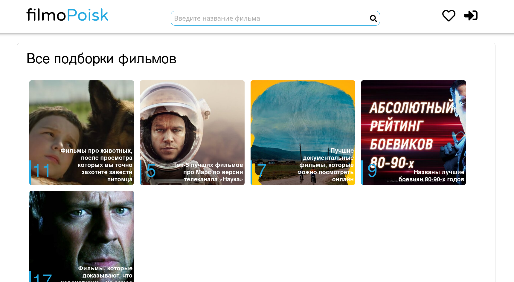
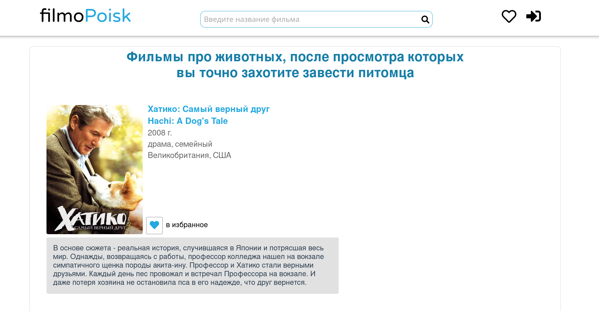
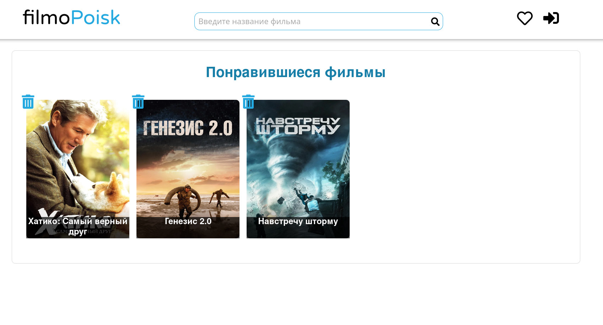

# filmo-poisk
## Сайт с подборкой фильмов по различным тематикам 
Написан на Vue.js с использованием следующих технологий:
```
Vue CLI
Vue Router
Vuex
Axios
```
## Главная страница сайта

## Список фильмов из подборки

## Понравившиеся фильмы

## Возможности
Данный проект находится на стадии разработки

- [x] Просмотр подборки фильмов
- [x] Получение данных фильмов по API
- [x] Возможность добавлять фильмы в "избранное"
- [x] Отдельная страница с информацией о конкретном фильме (его жанр, описание, интересные факты)
- [ ] Регистрация/ вход пользователя
- [ ] Возможность найти интересующий фильм в поиске
- [ ] Увеличение кол-ва подборок
- [ ] Рефакторинг кода

## Project setup
```
npm install
```

### Compiles and hot-reloads for development
```
npm run serve
```

### Compiles and minifies for production
```
npm run build
```

### Lints and fixes files
```
npm run lint
```

### Customize configuration
See [Configuration Reference](https://cli.vuejs.org/config/).
